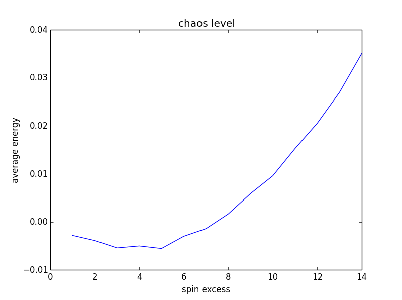
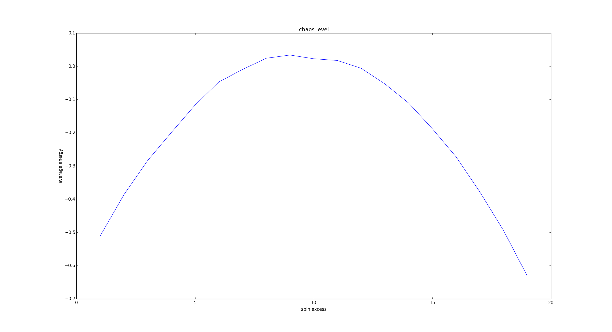
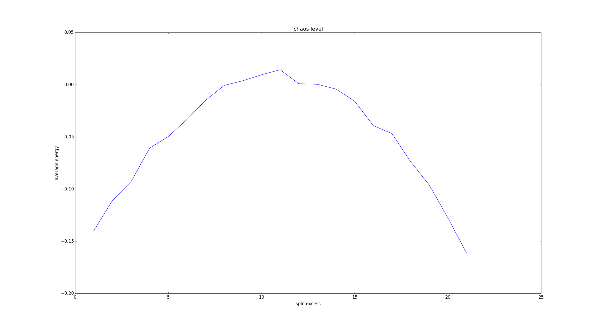
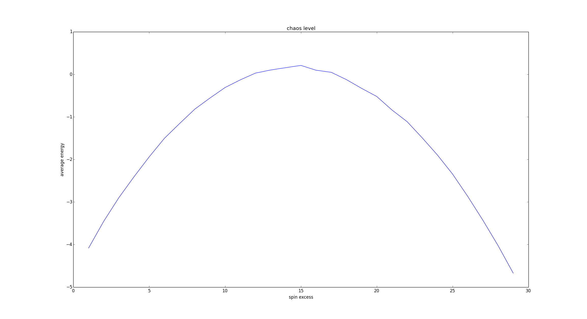
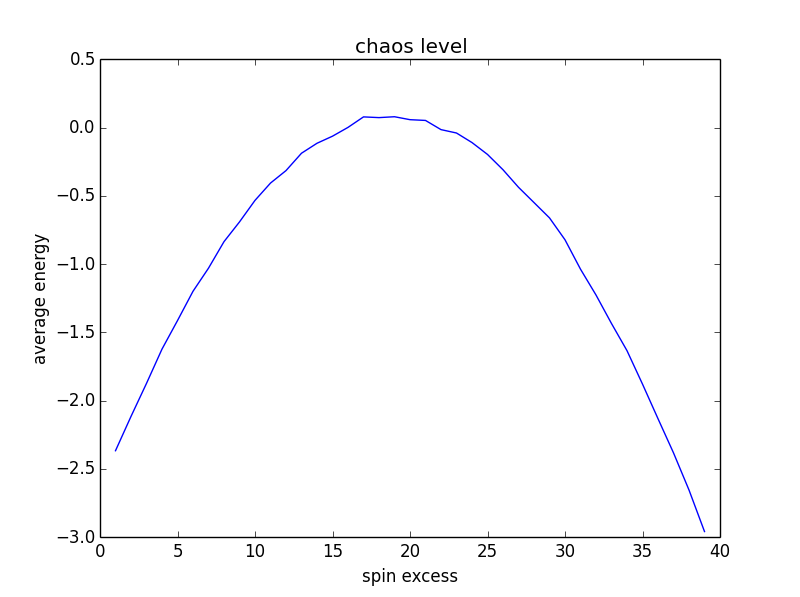
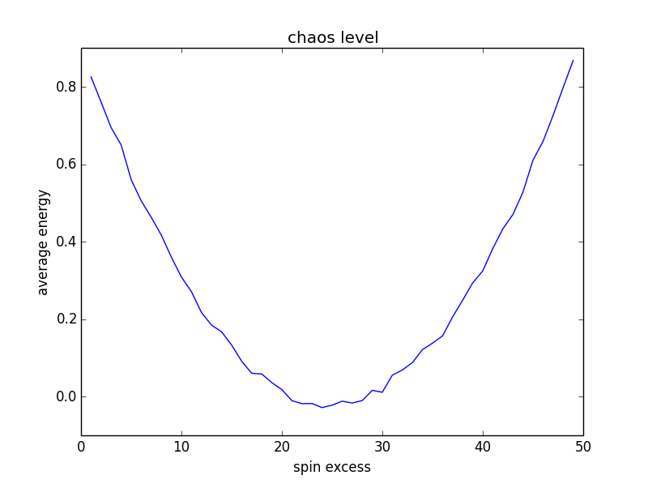
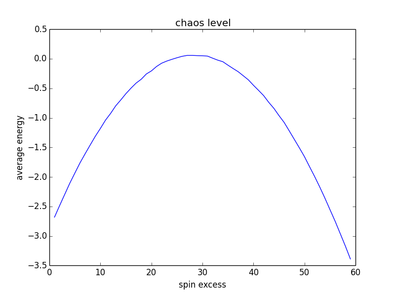
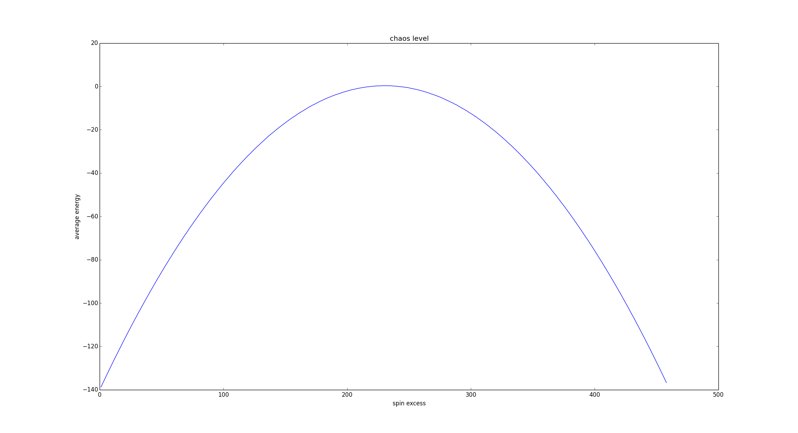

walkByEnergyFromGs
==================

Проверка теории, что при удалении от GS среднее значение энергии в системе уменьшается.
Ход действий следующий:
1. Создается система 20 частиц
2. Приводится в GS
3. Пробуем перевернуть каждую из частиц и считаем энергию такого состояния
4. Из полученных энергий высчитываем среднее
5. Переворачивается по 2 частицы
6. Высчитываем среднее
7. Продолжаем для 3 частиц... и т.д.

##Результаты
15 частиц, 5000 проходов для каждой:

20 частиц, 5000 проходов для каждой:

22 частицы, 10000 проходов для каждой:

30 частиц, 15000 проходов для каждой:

40 частиц, 20000 проходов для каждой:

50 частиц, 35000 проходов для каждой:

60 частиц, 35000 проходов для каждой:

458 частиц, 500000 проходов для каждой:

